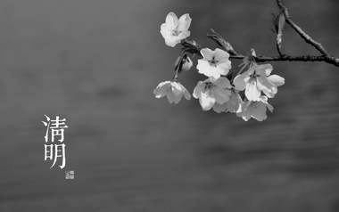
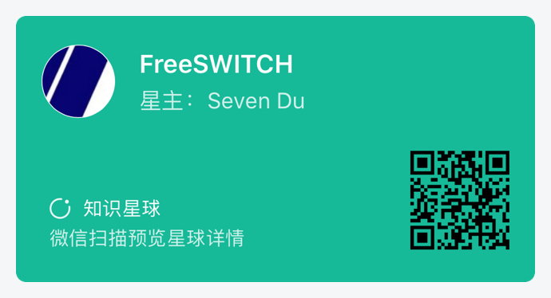

# 清明时节雨纷纷，写代码要认真

COVID-19新冠病毒爆发，几个月内席卷世界，这是人类历史上巨大的灾难。

几个月来，一大批医生奋战在一线，有的还献出了宝贵的生命。在全国人民的共同努力下，国内的疫情暂时被控制住，但国际形势依然严峻，没有人可以掉以轻心。

今年的清明节是个特殊的日子，缅怀先烈，也缅怀刚刚在战疫前线勋职的烈士。

4月4日10时起，全国人民默哀3分钟，汽车、火车、舰船鸣笛，防空警报鸣响。

各大网站也都换成了黑白色的图片。

作为程序员，除了不给祖国和世界添乱，宅在家里，我们还可以做点什么。学好技术，练好内功。吴军说，放到历史长河来看，真正推动世界发展的，不是王侯将相的攻城掠地，而是文明的力量，而科学家和工程师，比如这次奋战在抗战一线的医生，以及我们这些在后台不停地写代码默默无闻的工程师，正在推动文明发展的中坚力量。

欲练神功，挥剑……写代码。今天，我们来讨论一个问题：图片是怎么从彩色变成黑白的？

回答这个问题，我们先来看些基础知识：

* 单色图像

每个像素用一个比特表示，`0`为黑`1`为白。这样，有多少像素，就需要多少比特。我们以常见的720p图像为例子，图像一共有`1280 * 720
= 921600`像素，因此需要占用`921600 / 8 = 115200`个字节。

* 灰度图像

灰度图像一般使用256阶灰度，即用一个字节表示灰度值（`0 ~ 255`），因此，一帧720p的图像会占用`921,600`个字节。

* RGB图像

彩色图像使用RGB格式存储，每个像素占3个字节（`3 * 8 = 24`，又称24位真彩色），因此，一帧图像需要占用`2,764,800`字节。

有的彩色图像有Alpha通道，用一个字节代表透明度，`0`为透明，`255`为不透明，因此一个像素需要占用4个字节（正好是一个32位整数）。

RGB图像在内存中，由于计算机体系结构的不同，有不同的内部表示，如：

```
+-+-+-+-+-+-+-+-+-+-+-+-+
|R|G|B|R|G|B|R|G|B|R|G|B|       4个像素

+-+-+-+-+-+-+-+-+-+-+-+-+
|B|G|R|B|G|R|B|G|R|B|G|R|       4个像素

+-+-+-+-+-+-+-+-+-+-+-+-+
|R|G|B|A|R|G|B|A                2个像素，有Alpha通道

+-+-+-+-+-+-+-+-+-+-+-+-+
|B|G|R|A|B|G|R|A                2个像素，有Alpha通道
```

* CMYK色彩空间

RGB通常是发光体（如显示屏）或反光体（如你看见的任何东西）发出的，RGB的不同组合就产生了多彩的世界。发光体容易理解，但反光是怎么回事？比如一张纸，一本书，本身不会发光，当自然光照射到它上面时，它吸收掉一部分光，把不吸收的返回。比如我们常见的黑色，就是把所有光都吸收了，“看不见”，所以是黑的；而白色，则是什么光都不吸收，全部反射回来，我们就看到了自然光的反射（是的，如果用红光照射一张“白纸”，那么看到的就是红纸，而用任何颜色的光照射黑纸，看到的都是黑色）。

所以白纸是什么都没有，黑纸是涂了一层黑色（就是能吸引任何光线的物质），而其它颜色的纸则是有选择的吸收了光线，所以能反射不同的颜色。

所以在印刷业中，普遍使用的颜料都是吸光的。而这些颜料的基础本颜色称为三原色：Cyan，Magenta，Yellow（青、洋红、黄）。但是，是常生活中获取到的三原色颜料是不完美的，也就是说不纯，因此为了得到理想的颜色，又引入一种颜色blacK，总体称为CMYK。

总之，RGB是加色法，100％叠加后就是白色，而CMYK是减色法，叠加后是黑色。


CMYK只用在印刷中。我们在计算机中处理的大部分图像还是RGB的。

* YUV色彩空间

通过一定的公式，可以将RGB格式的图像换算到YUV色彩空间。YUV，是一种颜色编码方法。“Y”表示明亮度（Luminance、Luma），“U”和“V”则是色度、浓度（Chrominance、Chroma）。YUV色彩空间主要是利用了人类对Y分量比较敏感，而对U和V不是特别敏感。YUV色彩空间有以下两个特点：

* 方便支持彩色和黑白图像。
* 可以压缩节省空间。

其实本文的主题就在这里：**彩色YUV图像去掉U和V分量后就变为黑白的**。

RGB图像转换为YUV后可以按如下存储：

```
+-+-+-+-+-+-+-+-+-+-+-+-+
|Y|U|V|Y|U|V|Y|U|V|Y|U|V|
```

YUV图像与RGB图像的主要区别是，如果不管U和V，只看Y的话，就是黑白的。所以YUV色彩空间广泛用于广播电视中，同样的电视信号，黑白电视和彩电都能播放，只是黑白电视不需要管U和V。

YUV图像一般来说不是按像素存储，而是按平面（Plane）存储的。如：

Y平面：

```
+-+-+-+-+-+-+-+-+-+-+-+-+
|Y|Y|Y|Y|Y|Y|Y|Y|
```

U平面：

```
+-+-+-+-+-+-+-+-+-+-+-+-+
|U|U|U|U|U|U|U|U|
```

V平面

```
+-+-+-+-+-+-+-+-+-+-+-+-+
|V|V|V|V|V|V|V|V|V
```

按平面存储的好处显而易见，在黑白电视中只需要看Y平台而忽略其它平面。

FreeSWITCH内部主要使用YUV格式存储图像。

由于字节序的不同，在内存中的存储方式也有很多种，如：

```
YUVYUVYUVYUV
YVUYVUYVUYVU
YYYYUUUUVVVV
```

其它还有存储格式如`YVU`，`YUYV`，`YVYU`等，可以参考<http://www.fourcc.org/yuv.php>上面更多的图像格式。

#### YUV I420

原始图像占用很大空间，考虑到人类的感知能力，允许降低色度的带宽。常用的节约带宽的格式是I420格式。考虑一个4像素的正方形图片：

```
+----------+-----------+
| Y1 U1 V1 |  Y2 U2 V2 |
|----------+-----------+
| Y3 U3 V3 |  Y4 U4 V4 |
+----------+-----------+
```

由于人眼对U和V不是很敏感，因此，让其它三个像素都使用左上角像素上的U和V，图像变为：

```
+----------+-----------+
| Y1 U1 V1 |  Y2 U1 V1 |
|----------+-----------+
| Y3 U1 V1 |  Y4 U1 V1 |
+----------+-----------+
```

在这种情况下，如果按平面存储，格式为：

```
Y1 Y2 Y3 Y4
U1 U1 U1 U1
V1 V1 V1 V1
```

去除冗余，图像变为

```
Y1 Y2 Y3 Y4
U1
V1
```

将每4个像素作为一组进行这种处理，比原来的存储方式可以节省一半的存储空间。这种存储格式称为YUV I420。FreeSWITCH内部主要使用这种方式存储图像。主要的视频编解码器，如H264和VP8，也需要这种格式的图像做编解码。从这种压缩方式也可以看出，按平面存储比按像素存储也更容易计算，因为不同的平面可以有不同的长度。

由于4个像素为一组，所以，这种图像一般要求宽和高都为偶数。

YUV I420的存储格式为：`YYYYYYYY...UU...VV`，如果V在U前面，则称为YV12，即`YYYYYYYY...VV...UU`。

还有两个变种，Y平面独立，但U和V是交错存储的：

* NV12: `YYYYYYYY...UVUV`
* NV21: `YYYYYYYY...VUVU`

值得一提的是，NV12是Android上标准的图像格式。

有时候，为了能更高效的处理图像（比如整数计算的数据对齐），会在存储图像时在每一行结尾预留一些额外的空间，这些额外的空间就做`pitch`，而整个的行宽就叫做`stride`，如下图：

按像素存放的RGB图像：

```
|<------------stride---------------------->|
|<------------width------------->|<-pitch->|
+--------------------------------+---------|
|RGB RGB RGB RGB RGB RGB RGB RGB | PPPPPPP |
|RGB RGB RGB RGB RGB RGB RGB RGB | PPPPPPP |
|RGB RGB RGB RGB RGB RGB RGB RGB | PPPPPPP |
```

按平面存放的RGB图像：

```
|<------------stride---------------------->|
|<------------width------------->|<-pitch->|
+--------------------------------+---------|
|YYYYYYYYYYYYYYYYYYYYYYYYYYYYYYY | PPPPPPP |
|YYYYYYYYYYYYYYYYYYYYYYYYYYYYYYY | PPPPPPP |
|UUUUUUUUUUUUUUU|<-u-pitch->|
|UUUUUUUUUUUUUUU|<-u-pitch->|
|VVVVVVVVVVVVVVV|<-v-pitch->|
|VVVVVVVVVVVVVVV|<-v-pitch->|
```

好了，讲完了原理，该上代码了。将彩色图像转换为黑白图像的方法有很多，我们这里只使用FreeSWITCH。

```c
#include <switch.h>

int main(int argc, char **argv)
{
	switch_image_t *img = switch_img_read_png(argv[1], SWITCH_IMG_FMT_I420);
	switch_assert(img);

	int i, j;
	int w = img->d_w;
	int h = img->d_h;

	// yuv size need a even number
	if (w % 2) w--;
	if (h % 2) h--;

	for(j = 0; j < h / 2; j++) {
		for(i = 0; i < w / 2; i++) {
			uint8_t *u = img->planes[SWITCH_PLANE_U] + j * img->stride[SWITCH_PLANE_U] + i;
			uint8_t *v = img->planes[SWITCH_PLANE_V] + j * img->stride[SWITCH_PLANE_V] + i;
			*u = 128;
			*v = 128;
		}
	}

	switch_img_write_png(img, argv[2]);
	switch_img_free(&img);
}
```

为了简单起见，代码中没有错误处理。FreeSWITCH仅支持PNG格式的图像。打开后，遍历所有的行和列（注意I420格式的U和V宽度只有实际宽度的一半），将该分量清零（YUV空间中的所谓零（黑色）是128，如果将YUV分量值全部改成128，就是黑色图像，如果全部是0，就同绿色，如果在使用视频软件时看到绿屏，你可以情况YUV色彩空间的内存区域变部变成0了 ;) ）。

至于代码中的`PLANE`就是平面，`stride`的含义在上面也已经解释过了。




所有代码和图片都在Github上。欢迎点击阅读原文链接参观。

本文部分代码来自《FreeSWITCH源代码分析》，可以从下面的链接中找到购买方式。

我们前面已经开源了一些FreeSWITCH模块，近期会在中文社区的FreeSWITCH分支维护起来，请多关注我们的RTS社区以及Github项目。

* https://github.com/rts-cn RTS Github
* https://github.com/rts-cn/awesome-freeswitch
* RTS微信群：https://mp.weixin.qq.com/s/gqbCwixPKIpF8VDMi_YdUQ
* https://book.dujinfang.com/ FreeSWITCH相关图书





